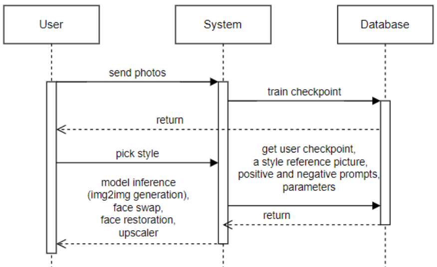

# Personal photo creator - telegram bot NymphLens

Our project aims to assist individuals in creating social media photos by generating images featuring their faces.

You can watch demonstration video [here](https://drive.google.com/file/d/1Lxk5jLsxXJJOfkEsO-K_JyZHNIn1w6vW/view?usp=drive_link)
and presentation [here](C:\Users\User\PycharmProjects\prompt_engineering\presentation.pdf).

### Team
- Dmitry Shironosov - co-founder of the NymphLens project, prompt expert
- Ivan Begunov - co-founder/CPO of the NymphLens project
- Alexander Shironosov - head of R&D
- Artem Nazarenko - developer
- Semina Anastasiia - prompt engineer

### Sequence Diagram

[//]: # (My task)

[//]: # (Hi! I am Nastya and I am in charge of the showcase of styles. My job is to find the best prompts and parameters for img2img generation using Stable Diffusion. I need to make sure that the generated photos are as similar to people as possible, so that our users can then post these photos on Instagram. This job is more mechanical and tedious than difficult. I've done a lot of experiments and prepared a women's showcase, now I'm starting to do men's. You can find more information in the presentation.)

[//]: # ()
[//]: # (Задача: сформировать витрину стилей, на основе которой генерировались бы фото. Стиль - это референсное фото, позитивный и негативный промпты, параметры: количество шагов, sampler, denoising strength и cfg_scale. )

[//]: # (1&#41; Было проведено множество экспериментов на чекпоинтах, обученных на разных людях, менялась структура промпта и его содержание. Я пришла к выводу, что не обязательно их делать по одному шаблону, чаще всего короткие промпты работают стабильнее и лучше. )

[//]: # (2&#41; Было произведено сравнение моделей: где получаются более реалистичные и качественные референсы. Мои фавориты - epiCRealism, epiCPhotoGasm, RealDream.)

[//]: # (3&#41; Была сделана женская витрина из 23 стилей, мужская сейчас в процессе доработки. Далее будет проводиться тестирование на разных людях, нестабильные стили будут правиться.)

[//]: # ()
[//]: # (Грустно, что у меня не было доступа к коду, все-таки мою работу можно было несколько автоматизировать &#40;проект коммерческий, я к нему присоединилась&#41;. Потом выяснилось, что WebUI, где я работала, и код под капотом у бота, где прогонялся весь пайплайн, выдают несколько разные результаты, сейчас это чинят. )

[//]: # (Еще кажется, что для данной задачи больше нужно работать с пайплайном и моделями, недавно вышла статья, подтверждающая это https://photo-maker.github.io/  Пока что генерируемые фото хоть и похожи, но все-таки что-то выдает их нереалистичность.)

