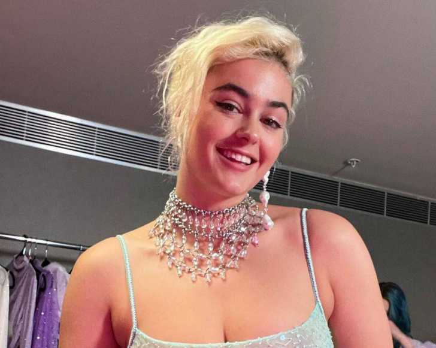
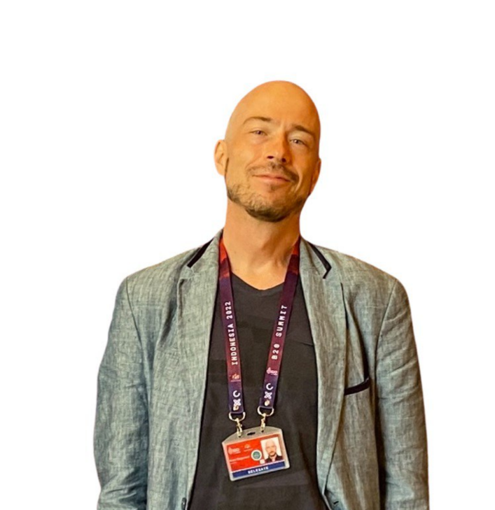

# Personal photo creator - telegram bot NymphLens

Our project aims to assist individuals in creating social media photos by generating images featuring their faces.

You can watch demonstration video [here](https://drive.google.com/file/d/1Lxk5jLsxXJJOfkEsO-K_JyZHNIn1w6vW/view?usp=drive_link)
and presentation [here](/presentation.pdf) ([new presentation](https://github.com/sad-bkt/photo_generation/blob/main/Presentation.pdf)).

## Team
- Dmitry Shironosov - co-founder of the NymphLens project, prompt expert
- Ivan Begunov - co-founder/CPO of the NymphLens project
- Alexander Shironosov - head of R&D
- Artem Nazarenko - developer
- Semina Anastasiia - prompt engineer

## Use-case diagram

AI personality is a Stable Diffusion checkpoint trained on the photos of 1 person.

## Sequence diagram

## My task for 1st semester

Create a window display of styles, on the basis of which photos would be generated. The style is a reference photo, positive and negative prompts, parameters: sampling method, sampling steps, denoising strength and CFG scale.

### Experiments

#### Finding the best model for reference generation 

In most cases, epiCRealism, epiCPhotoGasm, and RealDream performed well.

Experiments were carried out for different prompts and looked like this:

> Positive prompt:
> 
> portrait of beautiful fashion model, ethereal dreamy foggy, photoshoot by Annie Leibovitz, editorial Fashion Magazine photoshoot, fashion poses, in front of gothic cathedral architecture, Kinfolk Magazine, Film Grain, a soft smile, transparent sleeves, pastel colors dress, perfect hands, perfect eyes

> Negative prompt:
> 
> naked, deformed, distorted, disfigured, poorly drawn, bad anatomy, wrong anatomy, bad hands, bad body, bad face, bad teeth, bad arms, bad legs, deformities, extra limb, missing limb, floating limbs, mutated hands and fingers, disconnected limbs, mutation, mutated, ugly, disgusting, blurry, amputation,  worst quality, low quality, normal quality, lowres, low details, oversaturated, undersaturated, overexposed, underexposed, grayscale, bw, bad photo, bad photography, bad art, watermark, signature, text font, username, error, logo, words, letters, digits, autograph, trademark, name, blur, blurry, grainy, morbid, ugly, asymmetrical, mutated malformed, mutilated, poorly lit, bad shadow, draft, cropped, out of frame, cut off, censored, jpeg artifacts, out of focus, glitch, duplicate, airbrushed, cartoon, anime, semi-realistic, cgi, render, blender, digital art, manga, amateur, 3D, 3D Game, 3D Game Scene, 3D Character

| model                         | txt2img                   |
|-------------------------------|---------------------------|
| AbsoluteReality               |    |
| ColossusProjectXL             |    |
| CyberRealistic                |  |
| epiCPhotoGasm                 |  |
| epiCRealism                   |  |
| ICantBelieveItsNotPhotography |  |
| JuggernautXL                  |  |
| majicMIX                      |  |
| RealDream                     |  |
| RealHotSpice                  |  |
| RealisticStockPhoto           |  |
| RealisticVision51             |  |
| RealisticVision_v6            |  |
| Reliberate                    |  |

#### Search for the best prompts

A lot of experiments were conducted on checkpoints trained on different people. I used prompts from https://civitai.com/ and https://lexica.art/, changed them to get a more stable and good result. 

Experiments looks like:

> Positive prompt for img2txt:
> 
> portrait of beautiful fashion model, ethereal dreamy foggy, photoshoot by Annie Leibovitz, editorial Fashion Magazine photoshoot, fashion poses, in front of gothic cathedral architecture, Kinfolk Magazine, Film Grain, a soft smile, transparent sleeves, pastel colors dress, perfect hands, perfect eyes

> Positive prompt for img2img : 
> 
> ljz woman, portrait of beautiful fashion model, ethereal dreamy foggy, photoshoot by Annie Leibovitz, editorial Fashion Magazine photoshoot, fashion poses, in front of gothic cathedral architecture, Kinfolk Magazine, Film Grain, a soft smile, transparent long sleeves, pastel colors dress, perfect hands, perfect eyes

> Negative prompt:
> 
> naked, deformed, distorted, disfigured, poorly drawn, bad anatomy, wrong anatomy, bad hands, bad body, bad face, bad teeth, bad arms, bad legs, deformities, extra limb, missing limb, floating limbs, mutated hands and fingers, disconnected limbs, mutation, mutated, ugly, disgusting, blurry, amputation,  worst quality, low quality, normal quality, lowres, low details, oversaturated, undersaturated, overexposed, underexposed, grayscale, bw, bad photo, bad photography, bad art, watermark, signature, text font, username, error, logo, words, letters, digits, autograph, trademark, name, blur, blurry, grainy, morbid, ugly, asymmetrical, mutated malformed, mutilated, poorly lit, bad shadow, draft, cropped, out of frame, cut off, censored, jpeg artifacts, out of focus, glitch, duplicate, airbrushed, cartoon, anime, semi-realistic, cgi, render, blender, digital art, manga, amateur, 3D, 3D Game, 3D Game Scene, 3D Character

"ljz" is a token associated with a person. Training was conducted using the DreamBooth technique.

| reference    | checkpoint1  | checkpoint2  | checkpoint3  | checkpoint4      | checkpoint5  |
|---------------------------------------------|-------------------------------------|-------------------------------------|---------------------------------------|-------------------------------------------|---------------------------------------|
|                    |            |            |              |                  |              | 

#### Experiments with human nationality on a reference and enumeration of parameters

Checkpoints trained on me and CPO:

| Nastya                     |     Ivan             |
|----------------------------|---------------------------|
|   ||

Results can be found [here](https://drive.google.com/drive/folders/1bi_MzMdOjwfO-u7Q8jPTBUivkB5vxidk?usp=sharing)

All information in naming:

1) folders with and without faceswap - whether faceswap was used on the output or not, respectively;

2) further in the frame name: ivan / sad_bkt (Ivan or Nastya);

3) number of training iterations (800 or 1600);

4) frame name for img2img mode;

5) if gfpgan was used in preprocessing, then there is a postscript "_gfpgan".

### Results

A women's window display of 23 styles was made: you can see them in the demo [video](https://drive.google.com/file/d/1Lxk5jLsxXJJOfkEsO-K_JyZHNIn1w6vW/view?usp=drive_link).

Descriptions of generation problems and their solutions can be found in the [presentation](/presentation.pdf).

I came to the conclusion that it is not necessary to use universal template for prompt structure, most often short prompts work more stable and better.

## My task for 2d semester

:white_check_mark: Add formal business style to window display.

:white_check_mark: Conduct experiments with prompts to change age and obtain more natural skin.

:arrows_counterclockwise: Add college prom style to window display.

:arrows_counterclockwise: Conduct research: extract prompts from the collected dataset of Instagram photos and use them as new styles.
